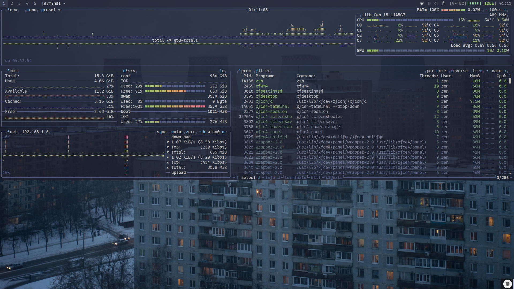
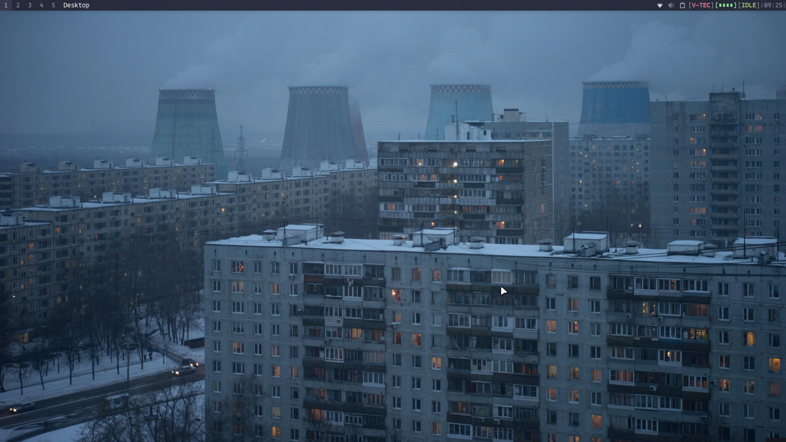
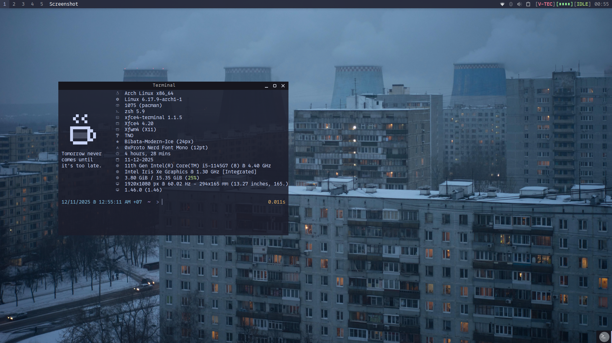
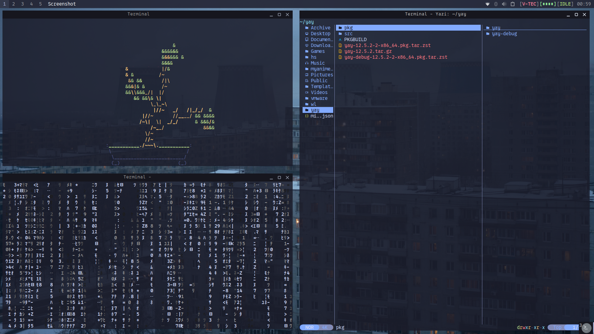
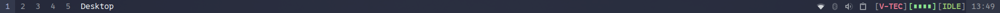
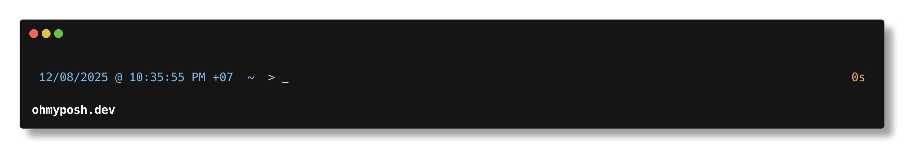

# Dotfiles

Personal Linux configuration files and setup documentation.

## Current Setup

| | |
|---|---|
| **OS** | Arch Linux |
| **DE** | XFCE4 |
| **Display Server** | X11 |
| **Hardware** | Lexar SL300 1TB (portable setup) |

  
  
  
  

---

## Installation Notes

Theme and icon directories (use `sudo` if needed):
- `/usr/share/sounds/`
- `/usr/share/themes/`
- `/usr/share/icons/`

Most configurations follow the [Arch Wiki](https://wiki.archlinux.org/title/Main_page).

> See [screenshots](screenshots/) for previous setups and [XFWM4-Standalone](XFWM4-Standalone/usr) for a not-so-minimal-but-educational configuration.

---

## Theming

### Window Manager
- [TNO](xfce4-themes/themes/TNO.zip)\* — Custom theme with gaps between windows
- Window tiling uses stock XFCE bindings (see [Keyboard Shortcuts](#keyboard-shortcuts))

### Panel

Customized **xfce4-panel** with **genmon** scripts:
- [windowTitle.sh](config/genmon/windowTitle.sh)
- [vtec.sh](config/genmon/vtec.sh)
- [batteryBar.sh](config/genmon/batteryBar.sh)
- [presentationMode.sh](config/genmon/presentationMode.sh)

### Terminal
- **xfce4-terminal** drop-down mode (see [Keyboard Shortcuts](#keyboard-shortcuts))
- **yay** + **zsh** + **oh-my-posh**
- Custom prompt: [minimal-tokyo.omp.json](config/minimal-tokyo.omp.json)\*

### Icons & Cursors
- [Tela-circle-blue](https://github.com/vinceliuice/Tela-circle-icon-theme) icons
- [Bibata-Modern-Ice](https://github.com/ful1e5/Bibata_Cursor) cursor

### Sounds
- KDE [ocean-sound-theme](https://github.com/KDE/ocean-sound-theme)
  > Enable via: *Appearance → Settings → Enable event sounds*

### GRUB
- [MilkGrub](https://github.com/gemakfy/MilkGrub) theme
- Theme collection: [Gorgeous-GRUB](https://github.com/Jacksaur/Gorgeous-GRUB)
- Installation: [Guide](https://github.com/Jacksaur/Gorgeous-GRUB/blob/main/Installation.md) | [Local copy](grub-themes/Installation.md)

### Browser Extension
- [Tokyo Night Tabs](custom-add-on(s)/Tokyo-Night-Tabs/)\* — LibreWolf/Firefox extension

---

## Security & Efficiency

### Power Management
- **tlp** (default: auto) + **cpupower-gui**
  > Default profile: Bottle (510 MHz/CPU, powersave) for [vtec.sh](config/genmon/vtec.sh)

### Firewall
- **ufw** — Configuration: [ufw-paranoid.sh](config/ufw-paranoid.sh)\*

### VPN
- [quickwg.sh](config/quickwg.sh)\* — WireGuard wrapper for Proton VPN
  > Requires **WireGuard** (AUR) and a **Proton VPN** account. Download config files from Proton VPN dashboard. Add symlink to `~/.local/bin/`.

### Disk Encryption
- LUKS encryption: [Arch Wiki Guide](https://wiki.archlinux.org/title/Dm-crypt/Encrypting_an_entire_system#LUKS_on_a_partition)
  > ⚠️ **Must be configured before system installation.** Use [archinstall](https://archinstall.archlinux.page/) for easy setup. [Connect to the internet](https://wiki.archlinux.org/title/Installation_guide#Connect_to_the_internet) first.

---

## Applications

### CLI Tools
| Package | Description |
|---------|-------------|
| **tmatrix** | Matrix rain animation |
| **yazi** | Terminal file manager (Thunar alternative) |
| **cbonsai** | Bonsai tree generator |
| **btop** | System monitor |
| **fastfetch** | System info ([ascii.txt](config/fastfetch/ascii.txt), [config.jsonc](config/fastfetch/config.jsonc)) |
| **neofetch** | System info ([config.conf](config/neofetch/config.conf)) |

### Input Method
- **IBus** / **IBus-Bamboo** — Special character input
  > May require restart after extended use: `ibus restart`

### Compatibility
| Package | Purpose |
|---------|---------|
| **VMware Workstation/Player** | Virtual machines |
| **Wine-Staging** | Windows compatibility ([guide](https://wiki.archlinux.org/title/Wine#Installation)) |
| **Flashpoint** | Flash game archive ([guide](https://flashpointarchive.org/datahub/Linux_Support)) |

### AI
- **LM Studio** — Local LLM inference
  > Models: Deepseek R1 Qwen3 8B, Qwen3 4B Thinking, Qwen2.5 Coder 7B/14B

### Productivity
| Package | Purpose |
|---------|---------|
| **LibreOffice** | Office suite |
| **Xtreme Download Manager** | Download manager |
| **VLC** / **mpv** | Media players |
| **Mousepad** / **VSCodium** | Text editors |
| **GIMP** / **Viewnior** | Image editing/viewing |

---

## Keyboard Shortcuts

| Action | Keybind |
|--------|---------|
| Tile Left | `Alt + ←` |
| Tile Right | `Alt + →` |
| Tile Up (Wide) | `Alt + ↑` |
| Tile Down (Wide) | `Alt + ↓` |
| Tile Up Left | `Alt + ;` |
| Tile Up Right | `Alt + '` |
| Tile Down Left | `Alt + ,` |
| Tile Down Right | `Alt + .` |
| Fullscreen | `Alt + /` |
| xfce4-terminal --drop-down | `Super + Z` |
| IBus-setup/Keyboard Shortcuts | `Alt + X` |

---

## TODO

- [ ] Clean up repository structure
- [ ] Create restoration script
- [ ] Migrate to Wayland (pending XFCE4 support)

---

\* Custom configurations tailored to personal preferences.
